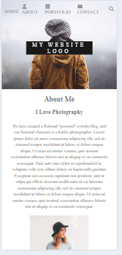

#  Responsive Static Website

##  Overview

Responsive Static Website is a web project built using HTML and CSS that demonstrates layout structure, styling, 
and responsive design across different screen sizes.

---

##  Features

*  Structured webpage layout using HTML
*  Styling using CSS
*  Responsive design for different screen sizes
*  Cross-device compatibility
*  Clean and simple UI

---

## Tech Stack

* HTML
* CSS

---

##  Screenshots

###  Desktop View


###  Mobile View



---

##  Live Demo

https://html-css-project-9tn2.vercel.app/

---

##  Run Locally

```bash id="d7t6cl"
# Clone the repository
git clone https://github.com/dhwani1006/Html_Css_Project.git

# Open index.html in browser
```

---

##  How It Works

1. HTML defines the structure of the webpage
2. CSS is used for styling and layout
3. Media queries ensure responsiveness across devices
4. Layout adapts based on screen size

---

